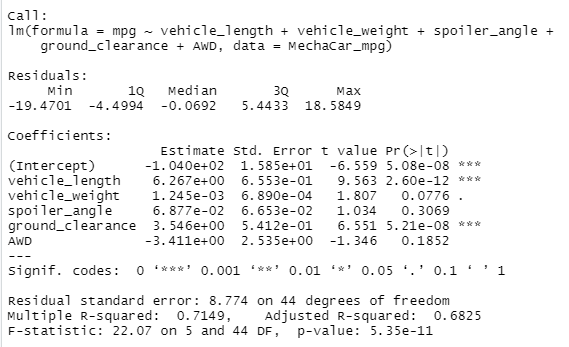
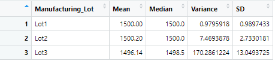
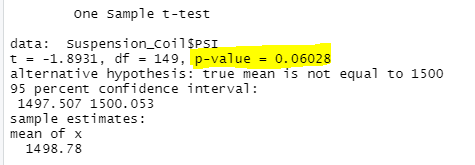
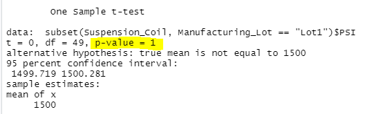
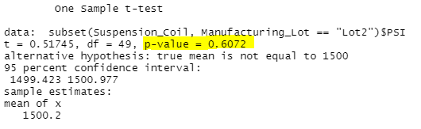
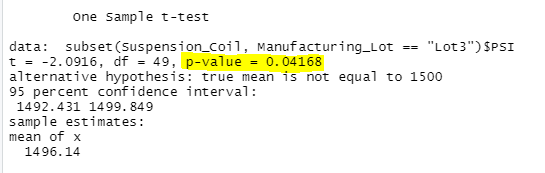

# MechaCar_Statistical_Analysis

## Linear Regression to Predict MPG

Question 1: Which variables/coefficients provided a non-random amount of variance to the mpg values in the dataset?

  Answer 1: The vehicle_length and the ground clearance.
  
Question 2: Is the slope of the linear model considered to be zero? why or why not?

  Answer 2: The slope is not considered to be zero.  The P-Value is 5.35e-11, which is much smaller than our assumed significance level of 0.05%.  Therefore, there is sufficient               evidence that the slope of our linear model is not zero.
   
Question 3: Does this linear model predict mpg of MechaCar prototypes effectively? Why or Why not?

  Answer 3: Yes, it does.  In this study, r-squared = 0.7149 indicating that over 70% of the variability of our dependent variable is explained using this linear model.
  
## Summary Statistics on Suspension Coils

We first made a summary table addressing the suspension coil's PSI across all manufacturing lots:

Then, we made a summary table addressing the mean, median, variance, and standard deviation for PSI for each lot:

The design specifications for the MechaCar suspension coils dictate that the variance of the suspension coils must not exceed 100 pounds per square inch.

The current manufacturing data for all manufacturing lots in total does meet this design specification.  However, for each lot individually, only lots 1 and 2 meet this design specification.  

## T-Tests on Suspension Coils

T-Tests were conducted to determine if all manufacturing lots and each lot individually are statistically different from the population mean of 1,500 pounds per square inch.
Assuming our significance level was the common 0.05%, our results are as follows:

### For all manufacturing lots
P-Value = 0.6028, indicating the means are statistically similar to the population mean of 1,500 pounds per square inch.

### For Lot #1
P-Value = 1.00, indicating the means are statistically similar to the population mean of 1,500 pounds per square inch.

### For Lot #2
P-Value = 0.06072, indicating the means are statistically similar to the population mean of 1,500 pounds per square inch.

### For Lot #3
P-Value = 0.04168, indicating the means are statistically different to the population mean of 1,500 pounds per square inch.

  
  
  
